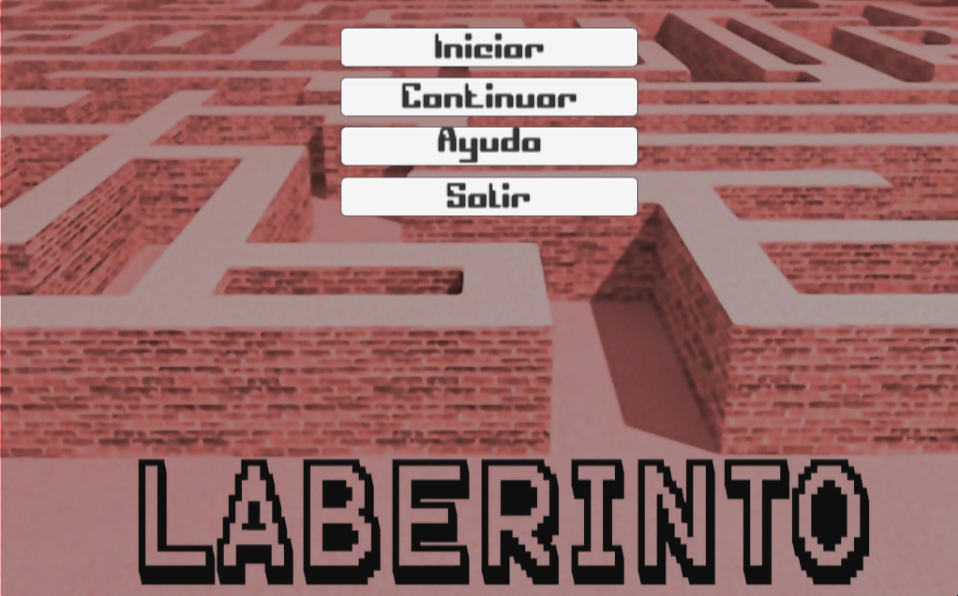

# Laberinto

Link Juego Web:

Web: https://walterm128.github.io/laberinto/

Link Descarga Juego PC:

https://mega.nz/file/ENtmRBjS#gYfYXFaYeRrfBSR4XSgFMnYmI_akanjQUCgcDUNOFLQ
(Para PC: mas fluido que en el navegador Web)

Novedades:
---------
15-11-2023
  * Se actualiza a Godot 4.2RC1
  * Se finaliza el cambio de página de los libros

14-11-2023
  * Se migra a Godot 4.2b6
  * Si teníamos una partida guardada se pueden perder, por la nueva forma de
    almacenamiento en disco (puede que sea necesario en ciertos casos abrir por
    segunda ves el juego, ya que en caso de error se crean de nuevo)
  * Se agrega barra de porcentaje de carga del nivel

07-11-2023
  * Shader Black Hole
  * Fix Portals
  * Cambio Sky

06-11-2023
  * Mas partes del juego con TrenchBroom
  * Sincronización de animaciones y sonidos
  * Mas oclusión en ciertos mapas

03-11-2023
  * Migrado a Godot 3.5.3
  * Se agrega la opción de sensibilidad del Mouse
  * Se agrega un nivel mas el número: 6 (TrenchBroom)
  * Los Libros cambian página con flechas: derecha e izquierda
  * Las llaves guardan el juego como check point

16-03-2023
  * Se agregan 2 niveles
    * HTerrain
  * Se Agrega auto guardado cuando salimos al menú principal
  * Se agrega NavAgent
  * Se migra a Godot Niveles 1, 2 y 3, de Game Jam Rosario, Santa Fe, Argentina

Recursos Laberinto:
  * Soul Cube: Danny Thomson
  * Texturas: https://www.realm667.com/index.php/en/
  * Música: Hellsoft

Más Juegos:

Sistema solar:

Web Godot: https://walterm128.github.io/GodotSolarSystem/

Showroom Liga Nacional de Robótica LNR:

Web: https://github.com/walterm128/LNR

PC: https://mega.nz/file/YVF2Ca6A#MCuADg-yHdbL3yOhuoibt6HjyO69HTKVcOpv09oTDW4

Otros:

https://github.com/walterm128/SoftwareExpo
